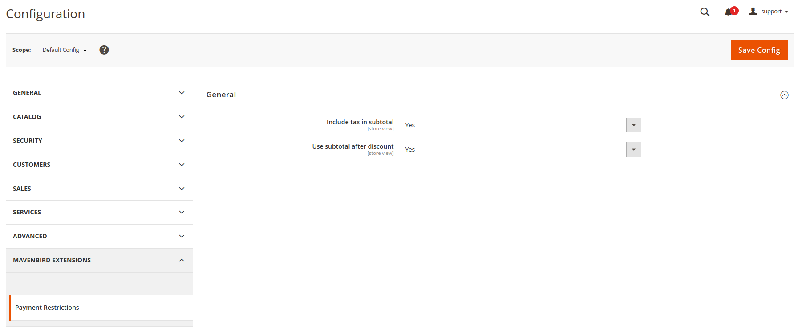
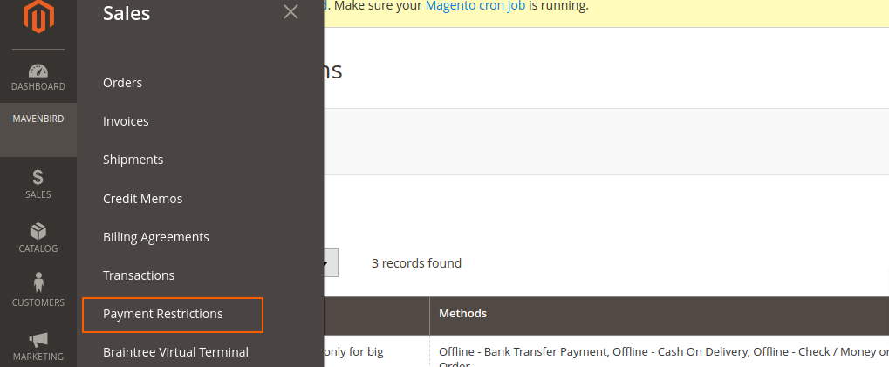
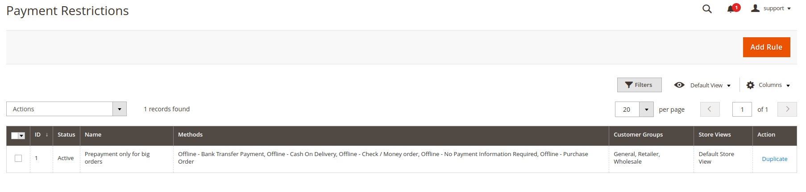
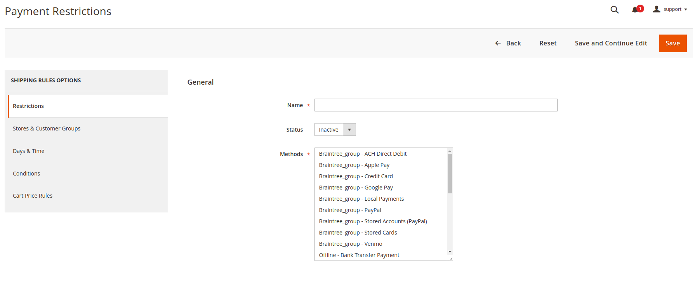
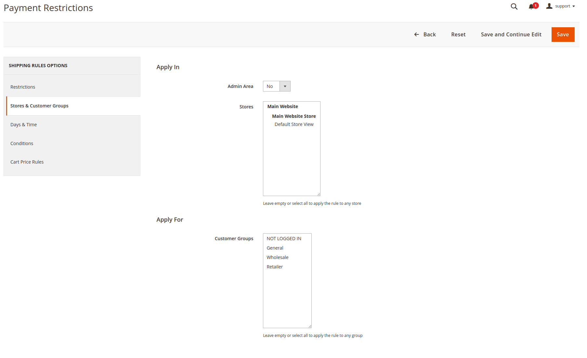
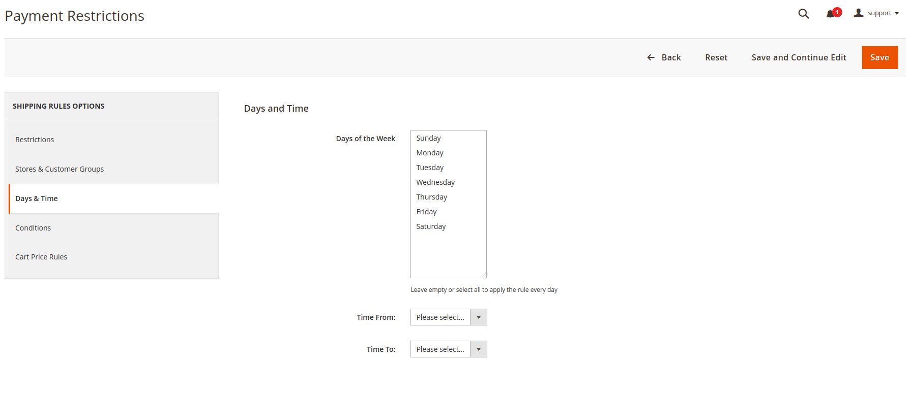
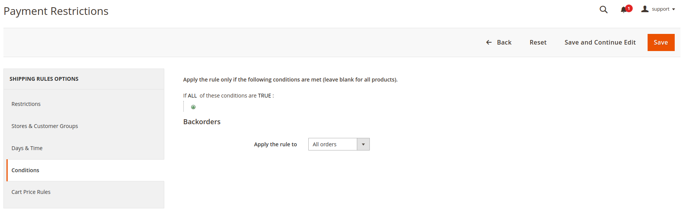
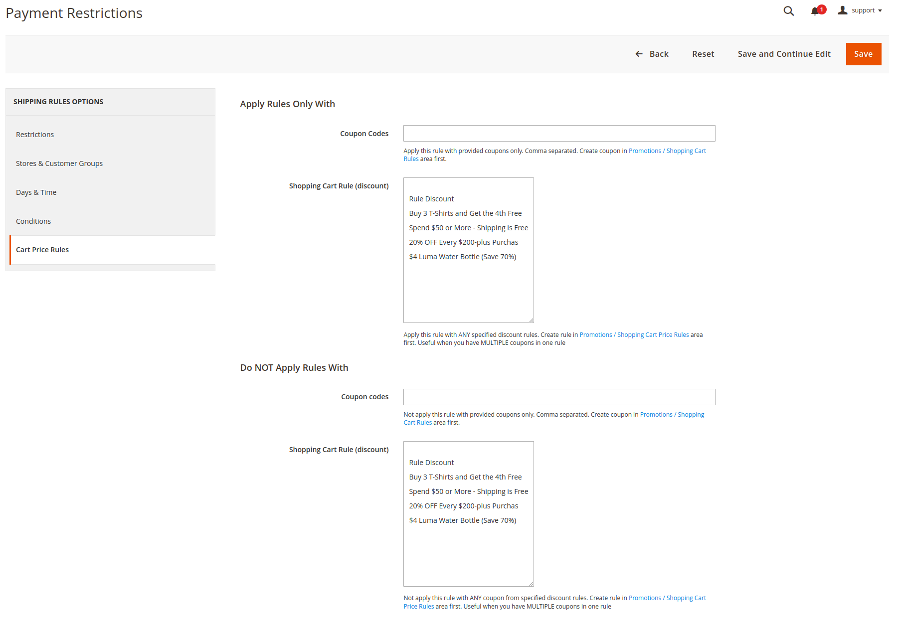
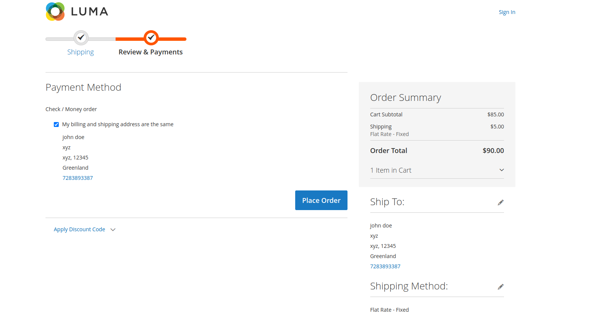

# Magento 2 Payrestriction Module

Enhance your Magento 2 store by restricting payment methods based on specific criteria. Our Magento 2 Payrestriction Module provides flexible options to control payment methods, ensuring a smooth checkout experience for your customers.

## Key Features:

- **Payment Method Restrictions:**
Restrict payment methods based on customer groups, order totals, shipping methods, and more.
- **Flexible Configuration:**
Easily configure restrictions from the admin panel with a user-friendly interface.
- **Granular Control:**
Set detailed rules for when and how payment methods are available.
- **Error Handling:**
Clear error messages guide customers if their selected payment method is unavailable.
- **Admin Control:**
Manage all restriction rules and settings directly from the admin panel.

## Benefits:

- **Enhanced Security:**
Reduce the risk of fraud by limiting payment methods based on specific criteria.
- **Improved Customer Experience:**
Ensure customers see only relevant payment options, reducing confusion.
- **Operational Efficiency:**
Streamline checkout processes with automated payment restrictions.
- **Customizable Options:**
Tailor payment method availability to suit your business needs.

## Compatibility:
This extension is compatible with Magento 2.4.X (PHP - 8.1 - 8.3) version.

## Installation:
**Install via composer (recommend)** - 

Easy installation process with step-by-step instructions provided for hassle-free setup.
~~~~~~~~~~~~~~~~~~~~~
composer require mavenbird/module-payrestriction
php bin/magento setup:upgrade
php bin/magento setup:static-content:deploy
php bin/magento setup:di:compile
php bin/magento cache:flush
~~~~~~~~~~~~~~~~~~~~~

## Upgrade/Update Module:
Run the following command in Magento 2 root folder for easy update -
~~~~~~~~~~~~~~~~~~~~~
composer update mavenbird/module-payrestriction
php bin/magento setup:upgrade
php bin/magento setup:static-content:deploy
php bin/magento setup:di:compile
php bin/magento cache:flush
~~~~~~~~~~~~~~~~~~~~~

## Customization Options:

Customize the payment restriction rules to match your store’s unique requirements, ensuring a tailored checkout experience for your customers.

*Configure at Your Ease*

## Support:
Our dedicated support team is available to assist with installation, customization, and any other queries or concerns.
*[support@mavenbird.com](mailto:support@mavenbird.com)*

## Get Started:
Enhance your payment method management with our Magento 2 Payrestriction Module. Simplify restriction management, improve customer experience, and streamline your workflows today!

*Thank you!*